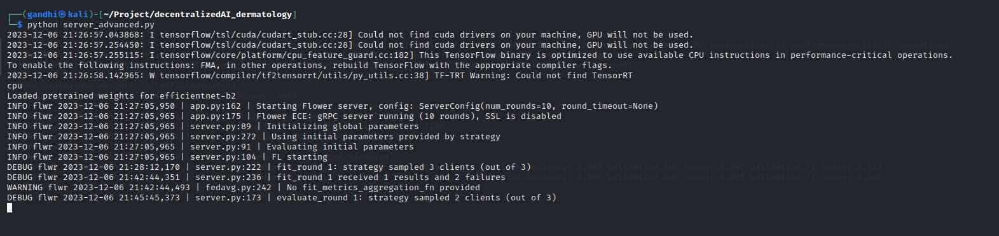
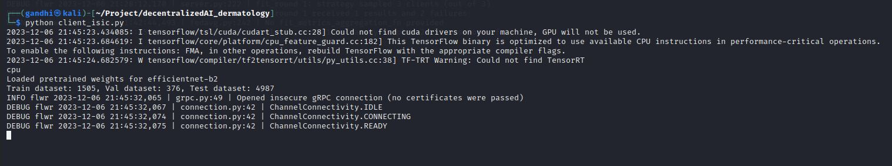
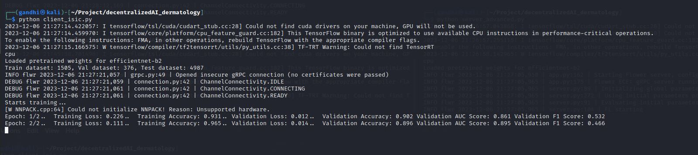

# Federated Learning Project

## Overview

This project implements federated learning for melanoma classification using PyTorch and Flower (FL). Federated learning is a machine learning setting where many clients (in this case, devices owned by end-users) collaboratively train a model under the orchestration of a central server (in this case, implemented using Flower). Flower (Fast, Lightweight, and Easy-to-use Federated Learning Framework) provides the infrastructure for orchestrating federated learning processes.

## Table of Contents
- [Project Structure](#project-structure)
- [Requirements](#requirements)
- [Setup](#setup)
- [Usage](#usage)
- [Configuration](#configuration)
- [Contributors](#contributors)
- [License](#license)
- [Contact Information](#contact-information)

## Project Structure

The project consists of the following Python files:

1. **server.py**: This file contains the code for the central server that coordinates the federated learning process.
2. **client.py**: This file contains the code for the client devices participating in the federated learning process.
3. **utils.py**: This file contains utility functions and classes used across the project, including data loading, model creation, training, and evaluation.

## Requirements

To run this project, ensure you have the following dependencies installed:

- Python 3.x
- PyTorch
- Torchvision
- NumPy
- Flower (FL)
- EfficientNet-PyTorch

You can install these dependencies using pip:

```bash
pip install torch torchvision numpy flwr efficientnet-pytorch
```

## Setup

1. Clone this repository:

    ```bash
    git clone https://github.com/your_username/your_repository.git
    ```

2. Navigate to the project directory:

    ```bash
    cd your_repository
    ```

3. Install the required dependencies:

    ```bash
    pip install -r requirements.txt
    ```

## Usage

### Running the Project

To start the federated learning process, follow these steps:

1. **Start the Server**: Run the `server.py` script to start the central server. You can specify the server address and configuration parameters such as the number of rounds for federated training.

   

    #### Central Server
    
    Start the central server by running:
    
    ```bash
    python server.py --host <server_host> --port <server_port> --rounds <num_rounds>
    ```
    
    Replace `<server_host>` and `<server_port>` with the desired host and port for the central server. `<num_rounds>` specifies the number of federated learning rounds.

3. **Start the Clients**: Run the `client.py` script on each client device to participate in the federated learning process. You can specify the server address and other parameters such as the model architecture and dataset path.

   

    #### Clients
    
    Deploy clients by running:
    
    ```bash
    python client.py --model "efficientnet-b2" --batch_train 32 --num_partitions 20 --gpu 0 --tags "Exp 5. FedBN" --path "/path/to/dataset" --host <server_host> --port <server_port>
    ```
    
    Replace `<server_host>` and `<server_port>` with the host and port where the central server is running. Adjust other parameters (`--model`, `--batch_train`, `--num_partitions`, etc.) based on your requirements.

5. **Monitor Training**: Monitor the training process on the server as it progresses through multiple rounds of federated learning. You can track metrics such as loss, accuracy, and AUC score.

   

## Configuration

You can configure various aspects of the federated learning process by modifying the arguments passed to the server and client scripts. These arguments include model architecture, dataset paths, number of rounds, batch size, and more.

## Contributors

- [Pritesh Gandhi]
- [Tarika Jain]

## License

This project is licensed under the [GNU GPL v3.0 License](LICENSE).

## Contact Information

For any inquiries or issues, please contact:
- **Pritesh Gandhi**
- **Email**: pgandhi1412@gmail.com
- **GitHub**: [GitHubProfile](https://github.com/Devil-Code)
